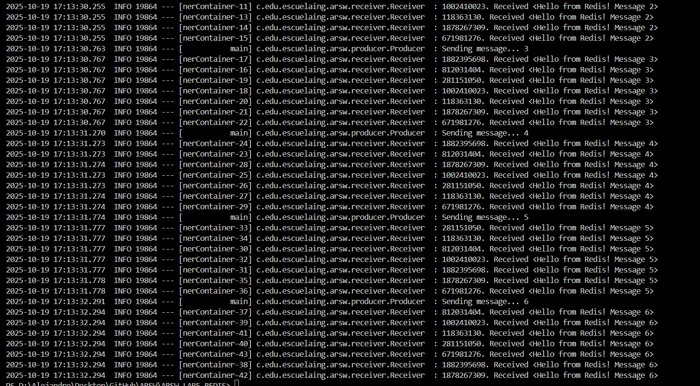

# LAB REDIS

**Autor:** [AlejandroPrieto82](https://github.com/AlejandroPrieto82)
**Proyecto:** ARSW - Laboratorio 5: Arquitectura de Eventos con Redis Pub/Sub
**Tecnologías:** Java · Spring Boot · Redis · Docker · Maven

---

## 🧠 ¿Qué es una Arquitectura Basada en Eventos?

Una **arquitectura basada en eventos (Event-Driven Architecture, EDA)** es un modelo de diseño donde los componentes del sistema **se comunican a través de eventos**.
Un evento representa un cambio o acción significativa (por ejemplo: *"nuevo pedido creado"*, *"usuario inició sesión"*, etc.).

En lugar de que los módulos se llamen entre sí directamente, cada componente **publica** eventos que describen lo que sucedió, y otros componentes **se suscriben** a ellos para reaccionar cuando sea necesario.

### 🔄 Características principales

* **Desacoplamiento:** los emisores no necesitan conocer a los receptores.
* **Asincronía:** los eventos se manejan de forma independiente y paralela.
* **Escalabilidad:** permite manejar grandes volúmenes de mensajes en tiempo real.
* **Extensibilidad:** se pueden agregar nuevos consumidores sin modificar el sistema base.

### 💡 Casos de uso comunes

* Sistemas de **notificaciones** y **mensajería instantánea**.
* **Microservicios** que se comunican mediante eventos.
* Procesamiento **asíncrono** de datos (colas de tareas).
* Aplicaciones **IoT** o de **streaming** en tiempo real.

---

## 🚀 Descripción general del proyecto

En este laboratorio se implementa una **arquitectura de eventos** usando **Redis como message broker**, aplicando el patrón **Publish/Subscribe (Pub/Sub)** con **Spring Boot**.

Redis se encarga de distribuir los mensajes enviados por un **productor** hacia varios **receptores (listeners)** de forma asíncrona, demostrando cómo se desacopla el flujo de comunicación entre los componentes.

---

## 🧩 Arquitectura del sistema

```
 ┌──────────────────────────────┐
 │         Producer             │
 │ (envía mensajes a Redis)     │
 └──────────────┬───────────────┘
                │
     convertAndSend("PSChannel")
                │
         ┌──────▼──────┐
         │   Redis     │
         │  (Broker)   │
         └──────▲──────┘
                │
      mensajes distribuidos a
                │
  ┌─────────────┴──────────────┐
  │         Listeners          │
  │ (instancias de Receiver)   │
  └────────────────────────────┘
```

Cada **Receiver** se suscribe al canal `"PSChannel"` y recibe todos los mensajes emitidos por el productor.

---

## ⚙️ Configuración del proyecto

### 1️⃣ Crear la aplicación Maven

```bash
mvn archetype:generate -DgroupId=co.edu.escuelaing.arsw \
-DartifactId=Publish-Subscribe-Redis \
-DarchetypeArtifactId=maven-archetype-quickstart \
-DinteractiveMode=false
```

---

### 2️⃣ Dependencias principales (`pom.xml`)

```xml
<dependencies>
    <dependency>
        <groupId>org.springframework.boot</groupId>
        <artifactId>spring-boot-starter-data-redis</artifactId>
        <version>2.3.1.RELEASE</version>
    </dependency>
    <dependency>
        <groupId>javax.inject</groupId>
        <artifactId>javax.inject</artifactId>
        <version>1</version>
    </dependency>
</dependencies>
```

---

## 🧱 Estructura del proyecto

```
src/
 ├── main/
 │   ├── java/co/edu/escuelaing/arsw/
 │   │   ├── PSRedisPrimerAppStarter.java
 │   │   ├── connection/
 │   │   │   ├── PSRedisConnectionConfiguration.java
 │   │   │   ├── PSRedisListenerContainer.java
 │   │   │   └── PSRedisTemplate.java
 │   │   ├── producer/
 │   │   │   └── Producer.java
 │   │   └── receiver/
 │   │       └── Receiver.java
 │   └── resources/
 │       └── application.properties
 └── test/
```

---

## 🧩 Descripción de componentes

### 🏁 `PSRedisPrimerAppStarter.java`

Clase principal que arranca el contexto Spring Boot.

```java
@SpringBootApplication
public class PSRedisPrimerAppStarter {
    public static void main(String[] args) {
        SpringApplication.run(PSRedisPrimerAppStarter.class, args);
    }
}
```

---

### 🔌 `PSRedisConnectionConfiguration.java`

Configura la conexión con Redis mediante `LettuceConnectionFactory`.
Usa valores definidos en `application.properties`.

```java
@Configuration
@PropertySource("application.properties")
public class PSRedisConnectionConfiguration {
    @Value("${redis.broker.hostname}")
    private String redisHostName;

    @Value("${redis.broker.port}")
    private int redisPort;

    @Bean
    public LettuceConnectionFactory redisConnectionFactory() {
        return new LettuceConnectionFactory(
            new RedisStandaloneConfiguration(redisHostName, redisPort)
        );
    }
}
```

---

### 📡 `PSRedisListenerContainer.java`

Contenedor de listeners de Redis que permite manejar las suscripciones de manera asíncrona.

---

### 🧰 `PSRedisTemplate.java`

Plantilla que simplifica el envío de mensajes tipo `String` a Redis.

---

### 📬 `Receiver.java`

Receptor de mensajes. Cada instancia escucha un canal (`PSChannel`) y procesa los mensajes recibidos.

---

### 🚀 `Producer.java`

Crea varios receptores y publica mensajes en el canal Redis.

---

## ⚙️ Configuración de Redis

Archivo `application.properties`:

```properties
redis.broker.hostname=localhost
redis.broker.port=45000
```

---

## 🐳 Ejecución de Redis con Docker

Ejecuta una instancia de Redis en el puerto `45000`:

```bash
docker run --name some-redis -p 45000:6379 -d redis
```

Verifica que Redis esté activo:

```bash
docker ps
```

---

## ▶️ Ejecución del proyecto

### 1️⃣ Compila el proyecto

```bash
mvn clean package
```

### 2️⃣ Ejecuta la aplicación

```bash
mvn spring-boot:run
```

o directamente:

```bash
java -jar target/RedisPubSubPrimer-1.0-SNAPSHOT.jar
```

---

## 📊 Resultado y prueba de funcionamiento

Cuando el sistema se ejecuta correctamente, el productor crea **7 receptores** (listeners) y envía **6 mensajes** a través del canal `PSChannel`.

Cada receptor recibe **todos los mensajes publicados**.  

  
**Resultados**

### 🧠 Ejemplo de salida en consola:

```
INFO  c.e.e.arsw.producer.Producer - Sending message... 1
INFO  c.e.e.arsw.receiver.Receiver - 131773963. Received <Hello from Redis! Message 1>
INFO  c.e.e.arsw.receiver.Receiver - 103589372. Received <Hello from Redis! Message 1>
INFO  c.e.e.arsw.receiver.Receiver - 145879011. Received <Hello from Redis! Message 1>
INFO  c.e.e.arsw.producer.Producer - Sending message... 2
INFO  c.e.e.arsw.receiver.Receiver - 131773963. Received <Hello from Redis! Message 2>
...
INFO  c.e.e.arsw.producer.Producer - Sending message... 6
INFO  c.e.e.arsw.receiver.Receiver - 103589372. Received <Hello from Redis! Message 6>
INFO  c.e.e.arsw.receiver.Receiver - 145879011. Received <Hello from Redis! Message 6>
```

### 📈 Interpretación del resultado

* El productor (`Producer`) publica mensajes numerados del 1 al 6.
* Cada **listener (`Receiver`)** recibe los mismos mensajes en tiempo real.
* Los `hashCode()` indican instancias diferentes de `Receiver`, mostrando que hay múltiples receptores concurrentes.
* La aplicación finaliza automáticamente después de enviar todos los mensajes.

---

## 🧠 Conclusión

Este laboratorio demuestra cómo **Redis puede actuar como un message broker** eficaz en una **arquitectura basada en eventos**, permitiendo una comunicación **asíncrona, desacoplada y escalable** entre componentes.

Spring Boot facilita la configuración y el manejo de los listeners, mientras que Redis proporciona la infraestructura para el intercambio de mensajes en tiempo real.

---

## ✍️ Autor

**Alejandro Prieto**
📍 Escuela Colombiana de Ingeniería Julio Garavito
🔗 GitHub: [@AlejandroPrieto82](https://github.com/AlejandroPrieto82)
